# ⚡ INS – Inertial Navigation System

[](https://opensource.org/licenses/MIT)
[](https://www.espressif.com/en/products/socs/esp32)
[](https://www.arduino.cc/)


> **Navigate anywhere, even when GPS fails.** 
 
> A complete, open‑source inertial navigation system built on  MCU – fusing IMU, BARO, MAGNETO, and GPS with a 15‑state Extended Kalman Filter. Designed for drones, ROVs, autonomous vehicles, and defence applications.

---

## 🎯 Vision & Mission


### Vision

To democratise precision navigation – making GPS‑denied positioning accessible to makers, researchers, and engineers worldwide. Whether you're building a drone that can navigate through tunnels, a rover that explores caves, or a missile that needs to find its target, this INS provides the core sensing and fusion logic.

### Mission

This project aims to deliver a **cost‑effective, reliable, and well‑documented** inertial navigation system that can operate without GPS for extended periods. By combining consumer‑grade sensors with advanced filtering and sensor fusion, we prove that precision navigation doesn't require expensive military‑grade hardware.

### Defence & Autonomous Applications


- **Drone navigation** – Maintain position when GPS is jammed or unavailable.
- **Missile guidance** – Provide continuous position, velocity, and attitude updates.
- **UGV / ROV navigation** – Track movement in tunnels, underground, or underwater.
- **Military reconnaissance** – Log accurate movement data without relying on satellites.
- **Autonomous vehicles** – Serve as a backup or primary navigation source.

---

## 🔥 What This Project Does


This system takes raw data from a consumer‑grade IMU, barometer, magnetometer and GPS, and turns it into **reliable 3D position, velocity, and attitude** – even in GPS‑denied environments. It runs on an  MCU at 200 Hz, serves a live web dashboard, and outputs NMEA sentences for Pixhawk or other autopilots.

**The magic:** A 15‑state EKF that estimates position (N/E/D), velocity (N/E/D), attitude (roll/pitch/yaw), and all sensor biases. ZUPT (Zero Velocity Update) kills drift when stationary. The magnetometer and GPS course correct yaw drift. Barometer and GPS velocity correct altitude and speed errors. All sensors work together to keep the solution accurate.

---

## 📷 Hardware Evolution


### Version 1 – Breadboard Prototype
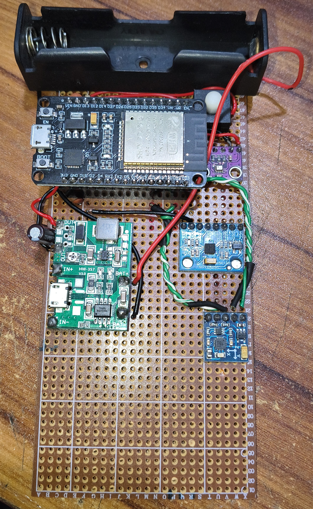
*First proof‑of‑concept:

### Version 2 – Custom PCB with Power Management
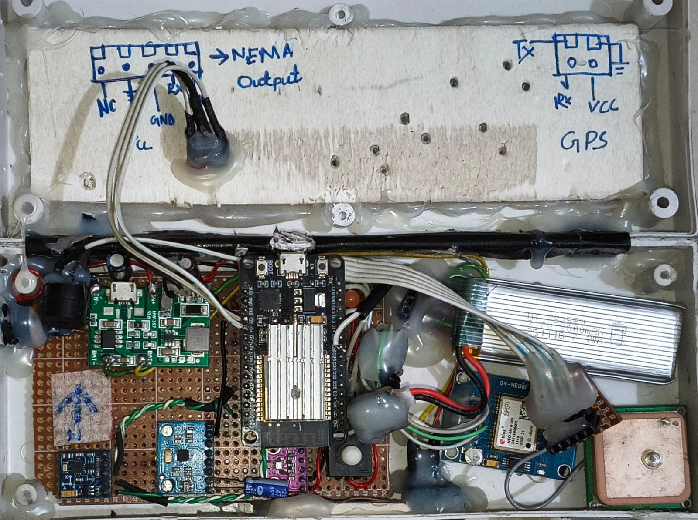
*First custom PCB: integrated 5V boost converter, 3.3V LDO, 4.7kΩ pull‑ups on I2C lines, and screw terminals for GPS and Pixhawk.*

### Version 3 – Final Compact Enclosure
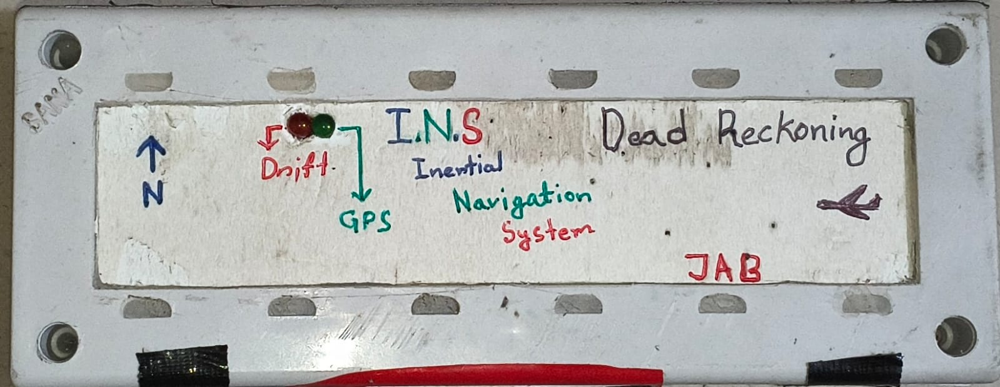
*Shielded case, vibration‑damped IMU mount, external SMA antenna for GPS, status LEDs and buzzer.*

---

## 🧠 How It Works – The Technical Story


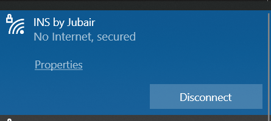
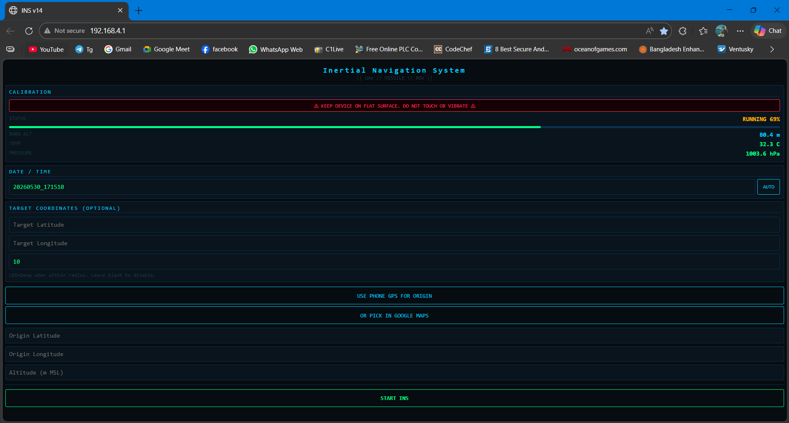 
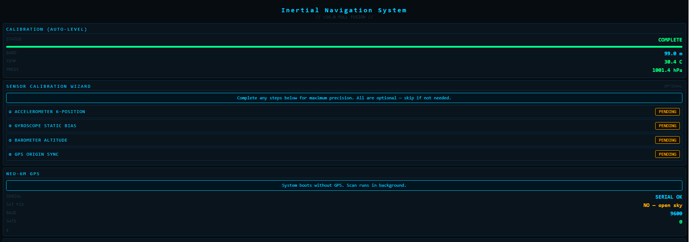
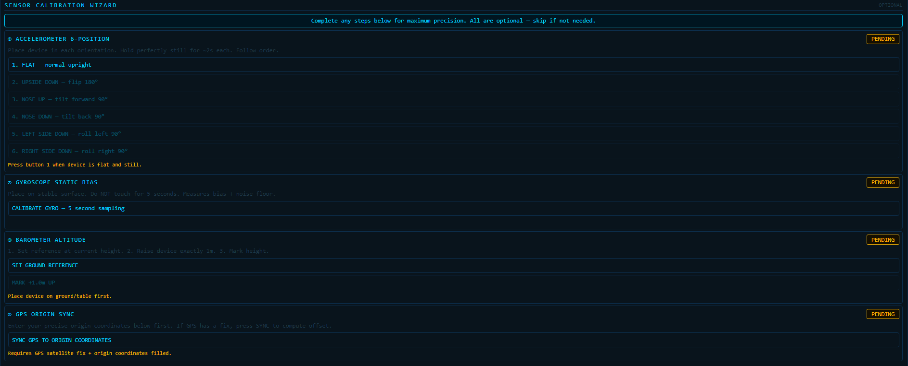
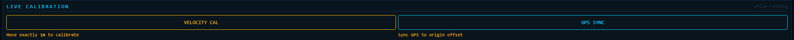
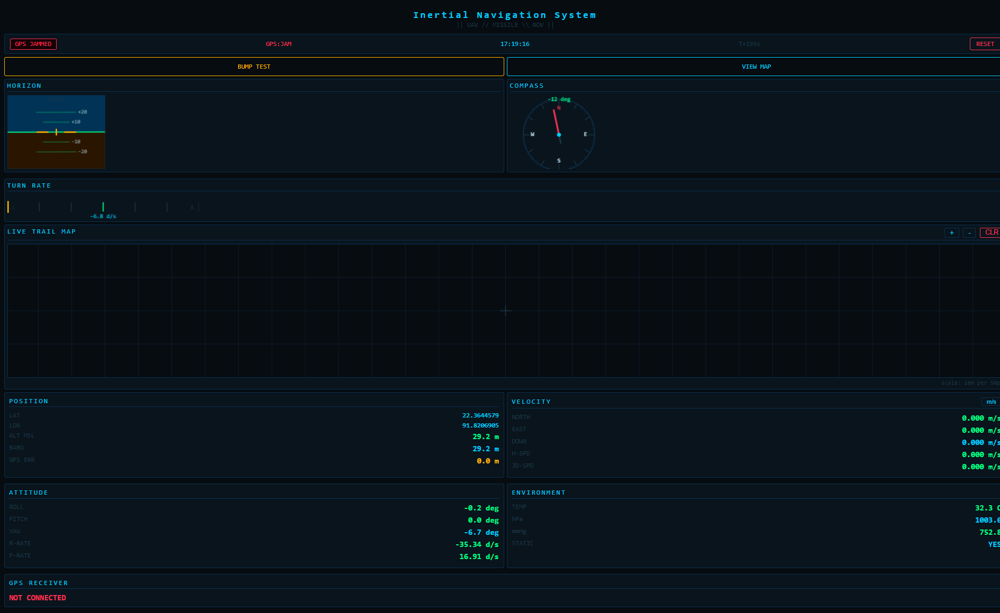
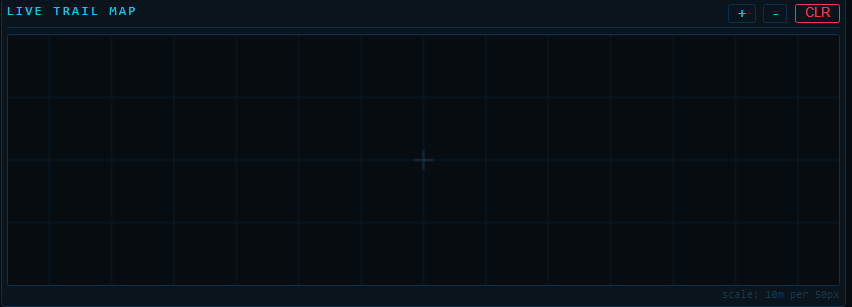 
 

---

### The Problem with Consumer IMUs

This is a fantastic sensor for the price, but it has three fatal flaws:
1. **Gyro bias** – Even the best calibration leaves residual bias that integrates to huge angles over time.
2. **Accel noise** – Double‑integration of noise creates kilometres of drift in minutes.
3. **I2C glitches** – A single corrupt read can send velocity to 150,000 m/s.

---

### Our Solutions

- **Median‑based 60‑second calibration** – Vibration‑immune gyro bias measurement.
- **Rate‑of‑change rejection** – Any gyro spike > 0.8 rad/s between samples is discarded.
- **ZUPT (Zero Velocity Update)** – When stationary, velocity is forced to zero; gyro biases are corrected.
- **Sensor fusion** – Magnetometer, GPS course, GPS velocity, and barometer all contribute to correct drift.
- **15‑state EKF** – Estimates position, velocity, attitude, and all biases in one unified filter.

---

## 🧠 The Sensor Fusion Pipeline

This diagram shows how data flows from each sensor through the EKF to produce the final navigation solution:

```
                    ┌───────────────────────────────────────────────────────────────────────────────────────────┐
                    │                                                                                           │
                    │                               S E N S O R S                                               │
                    │                                                                                           │
                    ▼                                                                                           │
     ┌───────────────────────────────────────────────────────────────────────────┐                              │
     │                                                                           │                              │
     │  ┌──────────────┐    ┌──────────────┐    ┌──────────────┐    ┌──────────┐ │                              │
     │  │              │    │              │    │              │    │          │ │                              │
     │  │     IMU      │    │  Barometer   │    │  Compass     │    │   GPS    │ │                              │
     │  │  Gyro+Accel  │    │              │    │              │    │          │ │                              │
     │  └──────┬───────┘    └──────┬───────┘    └──────┬───────┘    └────┬─────┘ │                              │
     │         │                   │                   │                 │       │                              │
     └─────────┼───────────────────┼───────────────────┼─────────────────┼───────┘                              │
               │                   │                   │                 │                                      │
               ▼                   ▼                   ▼                 ▼                                      │
     ┌───────────────────────────────────────────────────────────────────────────────────────────────────────┐  │
     │                                                                                                       │  │
     │                              F I L T E R S   &   F U S I O N                                          │  │
     │                                                                                                       │  │
     │  ┌───────────────────────────────────────┐              ┌──────────────────────────────────────────┐  │  │
     │  │     Complementary Filter              │              │          EKF Prediction                  │  │  │
     │  │     (Roll & Pitch)                    │              │  Position (N/E/D)   Velocity (N/E/D)     │  │  │
     │  │  96% Gyro + 4% Accel                  │─────────────►│  Attitude (R/P/Y)   Biases (Acc/Gyro)    │  │  │
     │  └───────────────────────────────────────┘              └───────────────────────┬──────────────────┘  │  │
     │                                                                                 │                     │  │
     │  ┌───────────────────────────────────────┐              ┌───────────────────────▼──────────────────┐  │  │
     │  │     ZUPT (Zero Velocity Update)       │              │          EKF Correction                  │  │  │
     │  │  Detects stationary via 32-sample     │─────────────►│  Altitude (Baro)   Heading (Compass)     │  │  │
     │  │  variance. Forces velocity = 0.       │              │  Position (GPS)    Velocity (GPS)        │  │  │
     │  └───────────────────────────────────────┘              └───────────────────────┬──────────────────┘  │  │
     │                                                                                 │                     │  │
     └─────────────────────────────────────────────────────────────────────────────────┼─────────────────────┘  │
                                                                                       │                        │
                                                                                       ▼                        │
	┌──────────────────────────────────────────────────────────────────────────────────────────────────────────┐|  
	│                                                                                                          │| 
	│                                    F U S E D   O U T P U T                                               │|  
	│                                                                                                          │|  
	│  ┌─────────────────────────────────────────────────────────────────────────────────────────────────────┐ │|  
	│  │  ✅ Position (N/E/D)   ✅ Velocity (N/E/D)    ✅ Attitude (Roll/Pitch/Yaw)  ✅ All 6 Sensor Biase │ │|  
	│  └─────────────────────────────────────────────────────────────────────────────────────────────────────┘ │|  
	│                                                                                                          │|  
	└──────────────────────────────────────────────────────────────────────────────────────────────────────────┘^  
                                                                                                                ^  
```
	
	
## 🔌 Hardware Requirements

---

## 🔌 Hardware Requirements – Component List

| Component | Model / Details | Notes |
|-----------|-----------------|-------|
| **MCU** | ESP32/STM32F4...|
| **IMU** | I2C address 0x68 | AD0 → GND; add 47µF cap on VCC |
| **Barometer** | I2C address 0x76 or 0x77 | ADDR → GND for 0x76 |
| **Magnetometer** | I2C address 0x0D |
| **GPS** | UART2: RX=GPIO16, TX=GPIO17 | **VCC → 3.3V** (NOT 5V!) |
| **NMEA (opt)** | UART1: TX=GPIO33 → FC GPS port RX | Outputs NMEA at 5Hz |
| **LEDs** | GPIO2, GPIO4, GPIO5 with 220Ω resistors | Drift, GPS fix, ZUPT indicators |
| **Buzzer** | GPIO26 (active low or via NPN transistor) | Arrival alert, GPS fix beep |
| **Power** | 5V/2A USB or 2S/3S LiPo with 5V boost converter |
| **Capacitors** | 47µF (IMU), 1000µF (GPS VCC), 100nF (each sensor) | Essential for stability |
| **I2C pull‑ups** | 4.7 kΩ resistors on SDA and SCL to 3.3V | Mandatory for reliable I2C |

---

## 🔌 Wiring Diagram

Below is the complete process flow of the INS system – from power‑on to continuous navigation:

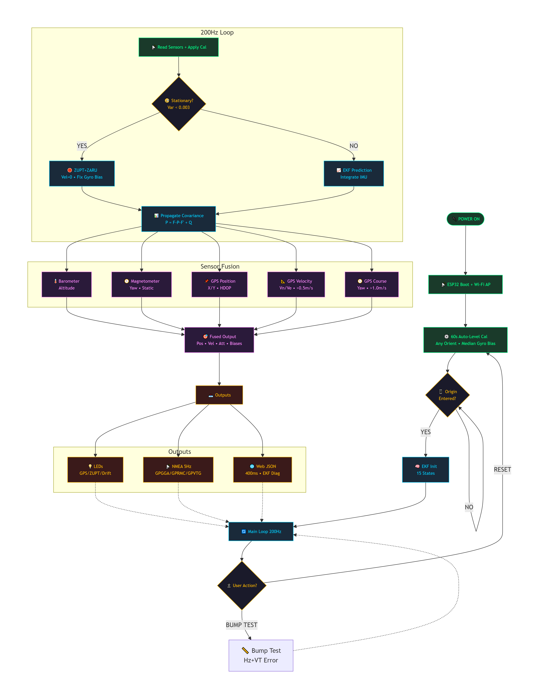

*The diagram shows the entire workflow: power‑on → calibration → EKF initialization → 200Hz main loop → sensor fusion → outputs.*

### Pin Connections

| MCU Pin   |      IMU      |     Baro      |        Compass     |     GPS      |    Optput     | LED / Buzzer |
|-----------|---------------|---------------|--------------------|--------------|---------------|--------------|
| **3.3V**  | VCC           | VCC           | VCC                | –            | –             | –            |
| **GND**   | GND           | GND           | GND                | GND          | GND           | GND          |
| **GPIO21**| SDA           | SDA           | SDA                | –            | –             | –            |
| **GPIO22**| SCL           | SCL           | SCL                | –            | –             | –            |
| **GPIO16**| –             | –             | –                  | RX (GPS TX)  | –             | –            |
| **GPIO17**| –             | –             | –                  | TX (GPS RX)  | –             | –            |
| **GPIO33**| –             | –             | –                  | –            | GPS port RX   | –            |
| **GPIO4** | –             | –             | –                  | –            | –             | LED_GPS (220Ω) |
| **GPIO5** | –             | –             | –                  | –            | –             | LED_STATIC (220Ω) |
| **GPIO2** | –             | –             | –                  | –            | –             | LED_DRIFT (220Ω) |
| **GPIO26**| –             | –             | –                  | –            | –             | Buzzer (via NPN) |

---

### I2C Bus (SDA = GPIO21, SCL = GPIO22)

```text
                    ┌──────────────────────────────────────┐
                    │              MCU                     │
                    │         SDA (GPIO21)                 │
                    │         SCL (GPIO22)                 │
                    └──────────────┬───────────────────────┘
                                   │
                    ┌──────────────┼───────────────────────┐
                    │              │                       │
                    ▼              ▼                       ▼
              ┌──────────┐  ┌──────────┐            ┌──────────┐
              │   (IMU)  │  │  (Baro)  │            │ (Compass)│
              │          │  │          │            │          │
              │   0x68   │  │  0x76    │            │   0x0D   │
              └──────────┘  └──────────┘            └──────────┘
```

**I2C Pull‑up Resistors:** 4.7 kΩ resistors on SDA and SCL to 3.3V – **strongly recommended** for reliable communication above 100 kHz.

---

### UART Connections

| UART | ESP32 Pin | Connected To | Purpose |
|------|-----------|--------------|---------|
| **UART2** | GPIO16 (RX) | GPS TX | Receives GPS NMEA sentences |
| **UART2** | GPIO17 (TX) | GPS RX (optional) | Sends commands to GPS |
| **UART1** | GPIO33 (TX) | NMEA GPS port RX | Outputs NMEA at 5Hz |

```text
GPS TX ──────────────────────> MCU GPIO16 (RX)
MCU GPIO17 (TX) ──────────────────> GPS RX (optional)

MCU GPIO33 (TX) ──────────────────> FC/NMEA GPS port RX
FC/NMEA GND ────────────────────────> MCU GND
```

---

### Power Connections

| Component | Voltage | Capacitor(s) | Notes |
|-----------|---------|--------------|-------|
| **MCU** | 5V (Vin) | – | Use 5V/2A USB or 5V boost converter |
| **IMU** | 3.3V | 47µF + 100nF | 47µF reduces I2C noise corruption |
| **BARO** | 3.3V | 100nF | Near the sensor VCC pin |
| **COMPASS** | 3.3V | 100nF | Near the sensor VCC pin |
| ** GPS** | **3.3V** (NOT 5V!) | 1000µF | GPS module has internal 3.3V regulator |


---

### LED & Buzzer Behaviour

| Component | GPIO | Resistor | Behaviour |
|-----------|------|----------|-----------|
| **LED_GPS** | GPIO4 | 220Ω | **Solid** = GPS fix fused into EKF<br>**Blink (600ms)** = GPS connected, searching<br>**Off** = GPS disconnected |
| **LED_STATIC** | GPIO5 | 220Ω | **ON** = ZUPT active (device is truly still)<br>**Off** = Moving |
| **LED_DRIFT** | GPIO2 | 220Ω | **Fast blink (150ms)** = Drifting while static<br>**Solid** = Moving normally<br>**Off** = OK |
| **Buzzer** | GPIO26 | 1kΩ (base) | **Double beep** = GPS fix acquired<br>**5s beep** = Target reached |

---

### Schematic Overview

```
                    ┌─────────────────────────────────────────────────────────────────┐
                    │                                                                 │
                    │  ┌─────────────┐                                                │
                    │  │   LiPo      │                                                │
                    │  │  2S/3S      │                                                │
                    │  │  7.4-12.6V  │                                                │
                    │  └──────┬──────┘                                                │
                    │         │                                                       │
                    │         ▼                                                       │
                    │  ┌─────────────┐     ┌─────────────┐                            │
                    │  │  Balance    │───> │   Boost     │                            │
                    │  │  Charger    │     │   Converter │                            │
                    │  └─────────────┘     │   MT3608    │                            │
                    │                      │   5V/3A     │                            │
                    │                      └──────┬──────┘                            │
                    │                             │                                   │
                    │                      ┌──────┴──────┐                            │
                    │                      │             │                            │
                    │                      ▼             ▼                            │
                    │               ┌─────────────┐ ┌─────────────┐                   │
                    │               │     MCU     │ │    NEO-6M   │                   │
                    │               │             │ │             │                   │
                    │               │    Vin 5V   │ │    GPS 5V   │                   │
                    │               └──────┬──────┘ └─────────────┘                   │
                    │                      │                                          │
                    │                      ▼                                          │
                    │               ┌─────────────┐                                   │
                    │               │  3.3V LDO   │                                   │
                    │               │  AMS1117    │                                   │
                    │               └──────┬──────┘                                   │
                    │                      │                                          │
                    │                      ▼                                          │
                    │               ┌─────────────────────────────────┐               │
                    │               │  3.3V I2C Bus (SDA/SCL)         │               │
                    │             ┌───────────┐ ┌───────────┐ ┌───────────┐           │
                    │             │ IMU       │ │ BARO      │ │ COMPASS   │           │
                    │             │ 0x68      │ │ 0x76      │ │ 0x0D      │           │
                    │             └───────────┘ └───────────┘ └───────────┘           │
                    │                     [4.7k] [4.7k] pull-ups                      │
                    │                                                                 |
                    │                                                                 │
                    │               ┌────────────────────────────────────────────┐    |
                    │               │  UART Connections                          │    |
                    │               │  GPIO16 ←── GPS        TX                  │    |
                    │               │  GPIO33 ───→ Pixhawk   RX                  │    |
                    │               └────────────────────────────────────────────┘    |
                    │                                                                 │
                    │               ┌────────────────────────────────────────────┐    |
                    │               │  LEDs & Buzzer                             │    |
                    │               │  GPIO4 ──[220Ω]─── LED_GPS                 │    |
                    │               │  GPIO5 ──[220Ω]─── LED_STATIC              │    |
                    │               │  GPIO2 ──[220Ω]─── LED_DRIFT               │    |
                    │               │  GPIO26 ──[1kΩ]─── NPN ─── Buzzer          │    |
                    │               └────────────────────────────────────────────┘    |
                    │                                                                 │
                    └─────────────────────────────────────────────────────────────────┘
```

---


## 🛠️ Software Setup – Step by Step

### Step 1: Install Arduino IDE
- Download from [arduino.cc](https://www.arduino.cc/en/software) (≥1.8.19).

### Step 2: Install Required Libraries
Open `Sketch → Include Library → Manage Libraries` and install.

### Step 3: Download the Firmware

- Clone this repository:

  ```bash
  git clone https://github.com/Jubairalberune/Inertial-Navigation-System.git
Or download the ZIP and extract.

### 📐 Complete Circuit Schematic

For a detailed view of the complete circuit – including power management, I2C bus, UART connections, LEDs, and buzzer – refer to the full schematic below:

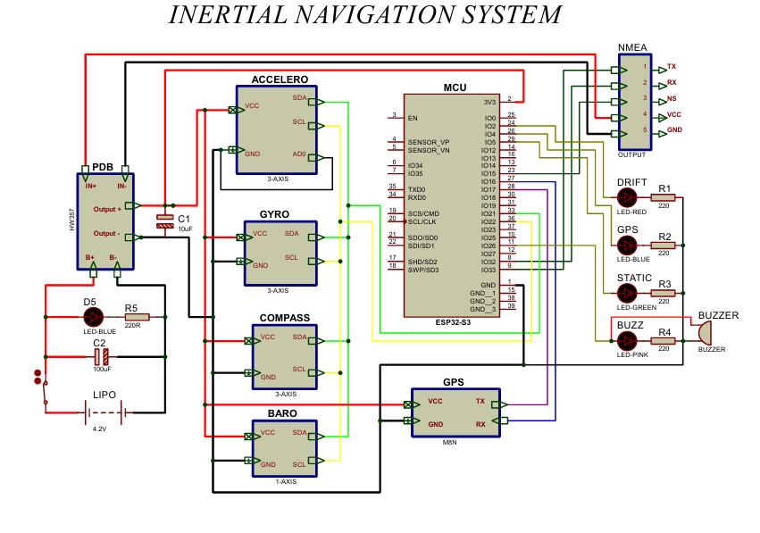

*Full circuit diagram showing: LiPo battery → balance charger → boost converter → ESP32 → sensors → LEDs → buzzer.*

### Step 4: Open the Sketch
In Arduino IDE, open firmware/INS.ino.

Make sure ins_web_page.h is in the same folder.


### Step 5: Configure Board Settings
Tools → Board → 

Tools → Port → Select your COM port


### Step 6: Compile and Upload
Click Verify to check for errors.

Click Upload


Step 7: First Power‑On
Open Tools → Serial Monitor.

You should see boot messages, then the 5‑second countdown, then 60‑second calibration.


## 📱 Operation – How to Use


### Step 1: Power On and Calibrate
Connect power to the MCU.

Place the board in its final operating position (any tilt is fine).

Wait for the 5‑second countdown, then DO NOT MOVE for 60 seconds.

After calibration, the buzzer beeps three times.


### Step 2: Connect to Wi‑Fi
On your phone or laptop, find the Wi‑Fi network INS by Jubair.

Password: 98765ins.

Open a browser and go to http://192.168.4.1.


### Step 3: Enter Origin Coordinates
Click USE PHONE GPS to auto‑fill your current coordinates (requires HTTPS on mobile).

Or manually enter Origin Latitude, Origin Longitude, Altitude.

(Optional) Enter Target Latitude/Longitude and arrival radius (default 10 m) – buzzer will beep on arrival.


### Step 4: Extended Calibration (Optional but Recommended)

After the 60‑second calibration, you'll see 5 optional calibration steps. These dramatically improve accuracy:

| Step | What it does | How to perform |
|------|--------------|----------------|
| **① Tilt Cal (6‑pos)** | Corrects accelerometer scale & offset per axis | Place device in 6 orientations: <br>**1.** Flat (normal upright) <br>**2.** Upside down (flip 180°) <br>**3.** Nose up (tilt forward 90°) <br>**4.** Nose down (tilt back 90°) <br>**5.** Left side down (roll left 90°) <br>**6.** Right side down (roll right 90°) |
| **② Compass Cal** | Removes hard‑iron distortion from nearby metal | Point device toward: <br>**1.** North <br>**2.** East <br>**3.** South <br>**4.** West |
| **③ Speed Cal (1m)** | Calibrates distance measurement accuracy | Walk exactly **1 metre** forward, press MARK |
| **④ Altitude Cal** | Calibrates barometer altitude scale | **1.** Hold at ground level, press REF <br>**2.** Lift exactly **1 metre** up, press MARK |
| **⑤ GPS Sync** | Aligns GPS to your exact coordinates | Requires GPS fix; press SYNC to match your known position |

---

### Calibration Wizard – Visual Overview

```text
┌────────────────────────────────────────────────────────────────────────────────────────────┐
│                         EXTENDED CALIBRATION WIZARD                                        │
│                                                                                            │
│  ┌─────────────────────────────────────────────────────────────────────────────────────┐   │
│  │  ① TILT CAL (6 positions)         ② COMPASS CAL (4 directions)                      │   │
│  │  ┌─────────────────────────────┐   ┌─────────────────────────────────────────────┐  │   │
│  │  │ Position 1: Flat            │   │ Direction 1: North                          │  │   │
│  │  │ Position 2: Upside down     │   │ Direction 2: East                           │  │   │
│  │  │ Position 3: Nose up         │   │ Direction 3: South                          │  │   │
│  │  │ Position 4: Nose down       │   │ Direction 4: West                           │  │   │
│  │  │ Position 5: Left side down  │   └─────────────────────────────────────────────┘  │   │
│  │  │ Position 6: Right side down │                                                    │   │
│  │  └─────────────────────────────┘                                                    │   │
│  └─────────────────────────────────────────────────────────────────────────────────────┘   │
│                                                                                            │
│  ┌─────────────────────────────────────────────────────────────────────────────────────┐   │
│  │  ③ SPEED CAL (1m)              ④ ALTITUDE CAL (1m)                                  │   │
│  │  ┌─────────────────────────────┐  ┌─────────────────────────────────────────────┐   │   │
│  │  │ 1. Walk exactly 1m forward  │  │ 1. Hold at ground level → Press REF         │   │   │
│  │  │ 2. Press MARK               │  │ 2. Lift exactly 1m up → Press MARK          │   │   │
│  │  └─────────────────────────────┘  └─────────────────────────────────────────────┘   │   │
│  └─────────────────────────────────────────────────────────────────────────────────────┘   │
│                                                                                            │
│  ┌─────────────────────────────────────────────────────────────────────────────────────┐   │
│  │  ⑤ GPS SYNC                                                                         │   │
│  │  ┌─────────────────────────────────────────────────────────────────────────────────┐│   │
│  │  │ Requires GPS satellite fix → Press SYNC → GPS aligns to your exact coordinates  ││   │
│  │  └─────────────────────────────────────────────────────────────────────────────────┘│   │
│  └─────────────────────────────────────────────────────────────────────────────────────┘   │
│                                                                                            │
│  💡 TIP: Steps ① and ② give the biggest improvement. All steps are optional – skip any.    │
└────────────────────────────────────────────────────────────────────────────────────────────┘
```


### Step 5: Start the INS
Press START INS.

The dashboard appears with live data.

### Step 6: Explore the Dashboard
Horizon – artificial horizon with pitch ladder

Compass – 360° rose with red north needle

Turn Rate – gyro Z‑axis rate

Live Trail Map – shows your path; zoom in/out, clear

Position / Velocity / Attitude – live numerical readouts

EKF Diagnostics – state vector, covariance, innovations, Kalman gains, ZUPT variance

Bump Test – measure drift error (move ~1 m away, press RETURN)

Target – set a target; buzzer beeps on arrival

### Step 7: Bump Test – Validate Your INS
Press BUMP TEST.

Move the device ~1 m away from start.

Press RETURN TO START.

The system reports drift error and a diagnostic:

| Drift | Rating | What it means |
|-------|--------|---------------|
| **< 0.10 m** | EXCELLENT | Perfect – your INS is highly accurate |
| **0.10 – 0.29 m** | GOOD | Acceptable for most applications |
| **0.30 – 0.49 m** | ACCEPTABLE | Tune ZUPT or reduce vibration |
| **≥ 0.50 m** | FIX ZUPT/Q | Re‑calibrate, check sensor mounting |

---


## 📊 Expected Performance

| Scenario | Drift |
|----------|-------|
| Stationary, ZUPT active | < 5 m / hour |
| Walking (1 m/s, no GPS) | 30–100 m / hour |
| With GPS (HDOP ≤ 1.5) | < 2 m (bounded) |
| GPS jammed for 30 s | < 15 m error when GPS returns |

These are realistic numbers for a consumer‑grade IMU. For better performance, upgrade to a tactical‑grade IMU.

---

## 🔬 EKF Diagnostics – What They Tell You

The dashboard includes a collapsible EKF Diagnostics panel that shows the filter's internal state in real time:

| Field | What it tells you | How to use it |
|-------|-------------------|---------------|
| **State vector** | Current estimate of position, velocity, attitude, biases | Watch these change in real time |
| **Covariance** | Uncertainty per state | Small = confident; large = uncertain |
| **GPS Innovation** | Difference between GPS and EKF position | Large = GPS or EKF is wrong |
| **ZUPT Innovation** | Velocity residual when stationary | Should be near zero |
| **Kalman Gains** | How much each measurement changes the state | High gain = strong trust |
| **ZUPT Variance** | Acceleration variance over 32 samples | < 0.003 = truly still |
| **ZUPT Confidence** | How sure the system is that you're still | > 80% = reliable |
| **EKF Health** | Overall filter stability | Green = healthy; yellow = degraded; red = unstable |

---

## 🛠️ Troubleshooting

| Symptom | Most likely cause | How to fix |
|---------|-------------------|------------|
| **No Wi‑Fi AP appears** | Power supply insufficient | Use a stable 5V/2A USB power supply |
| **GPS shows "NOT CONNECTED"** | Wiring or baud rate mismatch | Check GPS TX → GPIO16, GND, power |
| **Yaw drifts to 39845 degrees** | Gyro bias calibration corrupted by vibration | Re‑calibrate on a thick foam pad |
| **Velocity > 1000 m/s while still** | I2C corrupt readings (noise) | Add 4.7 kΩ pull‑up resistors |
| **IMU not found** | AD0 pin floating or 5 V power | Connect AD0 to GND (address 0x68) |
| **MCU reboots during calibration** | Watchdog timeout | Increase `timeout_ms` to 20000 |
| **Web page empty / white** | Raw string literal parsing issue | Re‑upload. Clear browser cache |
| **Calibration errors "Not enough movement"** | Movement too small | Walk/lift at least 1 m |

---

## 📈 Roadmap – What's Next

Tactical‑grade IMU support – Replace consumer‑grade IMU with tactical‑grade IMU for 3× lower noise and built‑in fusion

SD card logging – Log all EKF states and raw sensor data for post‑flight analysis

ROS integration – Publish INS data as ROS topics for robotics applications

Real‑time kinematic GPS – Support for RTK GPS for centimetre‑level accuracy

Multiple IMU redundancy – Cross‑check two IMU's for fault tolerance

---

## 🤝 Contributing


Contributions are welcome! Here's how you can help:

Report bugs – Open an issue with details of your hardware and the problem.

Suggest improvements – Feature requests are always welcome.

Submit pull requests – Bug fixes, new features, documentation improvements.

Please follow the existing code style and include comments for new functions.

---

## 📄 License
MIT – you are free to use, modify, and share this project. Please retain the original author's credit.

---

## 📚 Documentation & Resources

| File | Purpose | Read Time |
|------|---------|-----------|
| **[📖 Full Technical Reference](firmware/Inertial%20Navigation%20System_cpp%20page.md)** | Complete educational guide – explains every algorithm, EKF mathematics, sensor fusion, and calibration in detail | ~45 min |
| **[⚠️ Important Warning](firmware/WARNING.md)** | Critical information about code usage – read before using any firmware | ~5 min |
| **[🔌 Circuit Diagram](docs/circuit_diagram.txt)** | Hardware wiring diagram and component list | ~10 min |
| **[🔄 System Flow Diagram](docs/flow_diagram.md)** | Visual process flow of the INS system | ~5 min |

### 📖 Full Technical Reference

The **[Technical Reference](firmware/Inertial%20Navigation%20System_cpp%20page.md)** explains:
- 🔬 **15‑state EKF** – Mathematics and implementation
- 🧭 **Sensor fusion** – IMU, barometer, compass, and GPS integration
- 📐 **Calibration wizard** – All calibration steps
- 🛑 **ZUPT & ZARU** – Zero velocity and angular rate updates
- 🌐 **Web dashboard** – Architecture and API
- 📡 **NMEA output** – GPS sentences for Pixhawk

> 💡 **Best place to start** if you want to understand how the INS works before looking at the code.

### ⚠️ Important Warning

The **[Warning file](/firmware/WARNING.md)** explains that the firmware is **for educational purposes only** – **NOT** for production, drones, or safety‑critical systems. **Please read it before using any code.**

---

## 👤 Author

# **_Jubair Al Berune_**  
### *Electrical Engineer*

[](https://github.com/jubairalberune)
[](https://www.linkedin.com/in/jubair-al-berune/)
[](https://www.facebook.com/Jubair.Al.Berune/)

---

## 🙏 Acknowledgments


The open‑source community for the amazing libraries.

The  MCU team for a capable and affordable platform.

Everyone who tested early versions and provided feedback – your input shaped this project.

---

## ⭐ Support the Project

If you find this project useful, please **star** it on GitHub and share your results!

[](https://github.com/Jubairalberune/Inertial-Navigation-System/stargazers)
[](https://github.com/Jubairalberune/Inertial-Navigation-System/network/members)
[](https://github.com/Jubairalberune/Inertial-Navigation-System/watchers)

---

### 📢 Share Your Build

If you've built this INS, I'd love to see it!

- 📸 **Share photos** of your hardware
- 🎥 **Post videos** of it in action
- 💬 **Open an issue** with your results
- ⭐ **Star the repo** to help others find it

---

### 🐛 Found a Bug? Have a Suggestion?

[](https://github.com/Jubairalberune/Inertial-Navigation-System/issues)
[](https://github.com/Jubairalberune/Inertial-Navigation-System/pulls)

- **Report bugs** – [Open an issue](https://github.com/Jubairalberune/Inertial-Navigation-System/issues)
- **Request features** – [Start a discussion](https://github.com/Jubairalberune/Inertial-Navigation-System/discussions)
- **Contribute code** – [Submit a pull request](https://github.com/Jubairalberune/Inertial-Navigation-System/pulls)

---

### 📊 Repository Statistics

[](https://github.com/Jubairalberune/Inertial-Navigation-System/commits/main)
[](https://github.com/Jubairalberune/Inertial-Navigation-System)
[](https://github.com/Jubairalberune/Inertial-Navigation-System)
[](https://github.com/Jubairalberune/Inertial-Navigation-System)

---

**Built with passion, tested with patience – start navigating your own world!** 🚀
