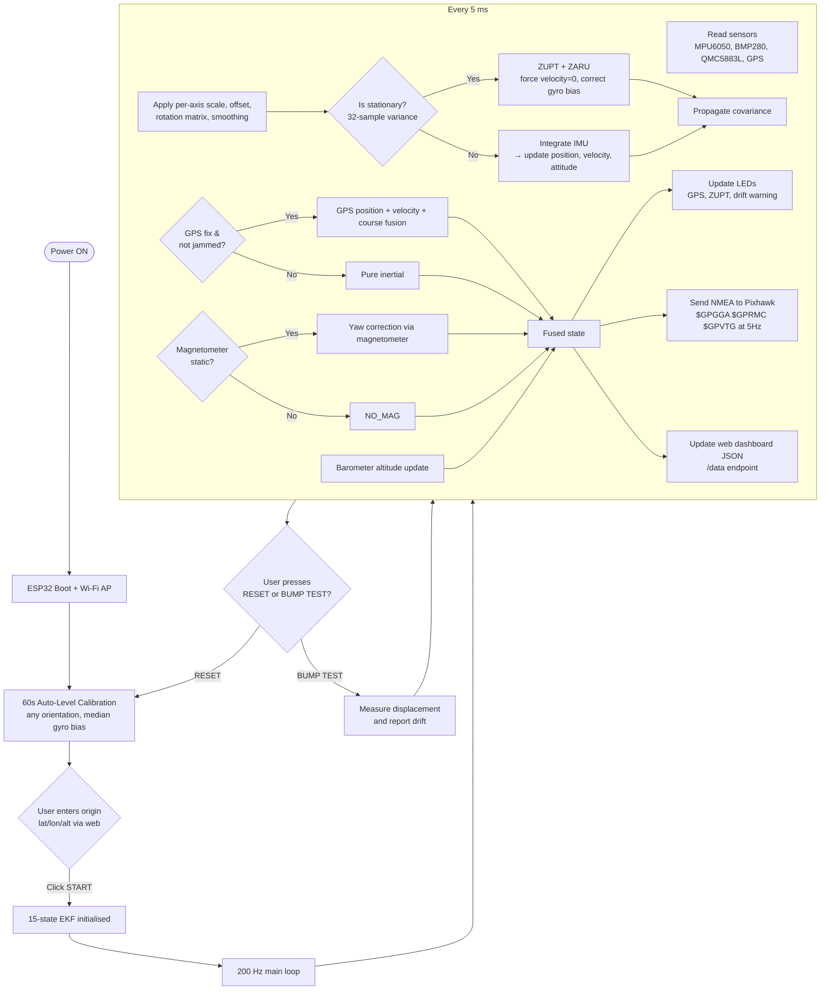

# System Flow Diagram

```mermaid
flowchart TD
    START([Power ON]) --> BOOT[ESP32 Boot + Wi‑Fi AP]
    BOOT --> CAL[60s Auto‑Level Calibration<br/>any orientation, median gyro bias]
    CAL --> USER_INPUT{User enters origin<br/>lat/lon/alt via web}
    USER_INPUT -->|Click START| EKF_INIT[15‑state EKF initialised]
    EKF_INIT --> LOOP_START[200 Hz main loop]
    
    subgraph LOOP [Every 5 ms]
        SENSORS[Read sensors<br/>MPU6050, BMP280, QMC5883L, GPS]
        CALIBRATION[Apply per‑axis scale, offset,<br/>rotation matrix, smoothing]
        STAT_DETECT{Is stationary?<br/>32‑sample variance}
        
        CALIBRATION --> STAT_DETECT
        STAT_DETECT -->|Yes| ZUPT[ZUPT + ZARU<br/>force velocity=0, correct gyro bias]
        STAT_DETECT -->|No| INTEGRATE[Integrate IMU<br/>→ update position, velocity, attitude]
        
        ZUPT --> COV[Propagate covariance]
        INTEGRATE --> COV
        
        GPS_CHECK{GPS fix &<br/>not jammed?}
        GPS_CHECK -->|Yes| GPS_FUSION[GPS position + velocity + course fusion]
        GPS_CHECK -->|No| PURE[Pure inertial]
        
        MAG_CHECK{Magnetometer<br/>static?}
        MAG_CHECK -->|Yes| MAG_FUSION[Yaw correction via magnetometer]
        MAG_CHECK -->|No| NO_MAG
    
        BARO_UPDATE[Barometer altitude update]
        GPS_FUSION --> FUSION[Fused state]
        PURE --> FUSION
        MAG_FUSION --> FUSION
        NO_MAG --> FUSION
        BARO_UPDATE --> FUSION
        
        FUSION --> LEDS[Update LEDs<br/>GPS, ZUPT, drift warning]
        FUSION --> NMEA[Send NMEA to Pixhawk<br/>$GPGGA $GPRMC $GPVTG at 5Hz]
        FUSION --> WEB[Update web dashboard JSON<br/>/data endpoint]
    end
    
    LOOP_START --> LOOP
    LOOP --> USER_INTERRUPT{User presses<br/>RESET or BUMP TEST?}
    USER_INTERRUPT -->|RESET| CAL
    USER_INTERRUPT -->|BUMP TEST| BUMP[Measure displacement<br/>and report drift]
    BUMP --> LOOP
```